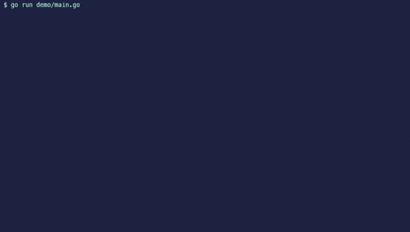

# Form - Simple form creator library


[](https://opensource.org/licenses/MIT)


Form is a simple library used to create interactive form in your console.

## Usage

Code available [here](./example/main.go)
```go
package main

import (
	"fmt"

	"github.com/jcalmat/form"
)

func main() {
	// Instantiate a new form
	myform := form.NewForm()

	// Create some fields for your form
	title := form.NewLabel("My form")
	check := form.NewCheckbox("Do you need to use form package?", false)
	check2 := form.NewCheckbox("Is this package interesting?", true)
	question := form.NewTextField("Any comment? ")

	// Add these fields to the form
	myform.Add(title, check, check2, question)

	// Display your form
	myform.Ask()

	// Handle the answers
	fmt.Printf(`use form package? = %v
is this package interesting? = %v
comment = %v
`, check.Answer(), check2.Answer(), question.Answer())
}
```

This code will produce the following output

